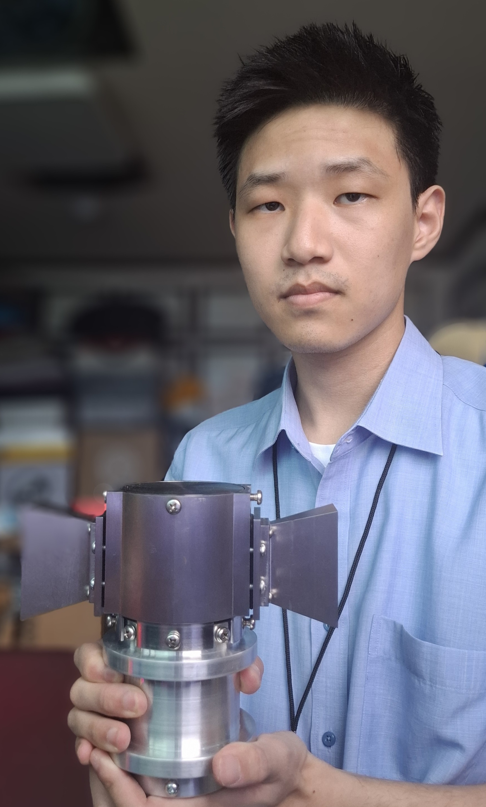

# ANVIL Aeronautics

> "I protect the FREEDOM and TRUTH, and make imagination real."

## 1. Introduction: Who Am I?
> Mobility (Freedom of Movement)
> 
> National Security (Protection of Freedom)
> 
> Aerospace Engineering (The Future of Humanity)

I am Seokjoon Lee from South Korea.
This year 2026, I am a senior in Seoul National University. I do love my major, Aerospace Engineering.
I want to be a Doer, testing the limitation of system and showing the world results.

My personal belief is following:

> In terms of faith, I believe in Jesus
> 
> In terms of Human being, I love my family, my friends, and my neighbors
> 
> In terms of Universe, I do believe the power of Science and Technology

---

## 2. A Long Journey to become an Engineering-based Entrepreneur
Actually, until sophomore, I wanted to become a professor. But in fall semester of sophomore, my eagerness to do practical things was poping out.
In 2023, when I was a junior
동아리 창설->창설축 물로켓 만들기 시작
교통 관련->자동차 동아리, 대형 면허, 교통사고 조사 자격증

In 2024, 휴학 했다.
초반: 물로켓 (팀 빌딩의 원칙을 배움, 성공 사례)
중반: 드론 설계하면서 놀았다
후반: 창설축 1등(급발진 + 토크 -> 간단한 원리 소개) -> ICDF 3등(중국 놈들 무섭다, 끝을 봐야 한다) + 측추력기 개발

In 2025, 휴학 1년 더 했다.
미국도 다녀왔다. 나의 정신적 조국과도 같은 곳이다.
예비 창업 하려고 시도했다. 하지만 실패했다. 13kg 빠지고, 불안/공황이 왔다.
이유: 예창패 실패, 갖은 비판, 인간관계 -> 이때의 아이템이 드론에서 로켓 쏘는 것임을 보여주자.
하지만 결국 재기에 성공함(5월: 주님을 만났고, 6월: 아이디어톤 1등)
오니솝터를 만들기 시작했다. 500만원 + 11호기까지, 15회 이상 날렸는데 다 실패했다.
학장과도 면담해서 지원 사업을 따냈다.
ADEX 가서 내 신념이 맞다는 것을 입증했다.
하는 것마다 다 안 됐다. 모든 대회에서 실패했으니까.
11월: 다양한 사람들을 만났다. 투자자도 만나고 했다.
12월: 그래서 그냥 에어빌리티에서 인턴을 했다. 그물총을 만들었다.
좀 괜찮아져서 다시 연구를 시작했다.

이제, 미래를 향한 나의 여정은 다시 시작한다.

## 3. My Projects
미래를 향한 나의 5대 핵심 프로젝트는 아래와 같다.
<a href="ornithopter.html" class="project-card">
    
    <strong>Ornithopter with Peak</strong>
    A Drone emulating birds' flapping motion
</a>

<a href="aerorover.html" class="project-card">
    
    <strong>AeroRover (Hybrid Mobility)</strong>
    Terrestrial and Aviational Combined Mobility System
</a>

<a href="hydrogen.html" class="project-card">
    
    <strong>Hydrogen Hybrid Drone</strong>
</a>

<a href="bci.html" class="project-card">
    
    <strong>Cognitive Attack with Microwaves</strong>
</a>

<a href="nasa.html" class="project-card">
    
    <strong>NASA Vulnerability</strong>
</a>

### (1) Project "Ornithopter"
생체 모방 비행 기술 및 대드론 방어 체계 연구. MATLAB 및 Ansys Fluent를 활용한 정밀 유체역학 해석을 완료했습니다.

### (2) Project "AeroRover"
지상 주행과 공중 비행이 모두 가능한 차세대 하이브리드 모빌리티 시스템 (Hybrid Mobility System).

### (3) Hydrogen Hybrid Drone System
수소 하이브리드 드론 개발을 위한 수소 스택 이용에 대한 제어공학적 방법을 만들었습니다.

### (4) Harvana Syndrome
전파 공격 무기에 대한 연구를 수행하였습니다. (Coming Soon)

### (5) NASA Security Vulnerability
나사 보안 취약점을 찾았습니다. (Coming Soon)
