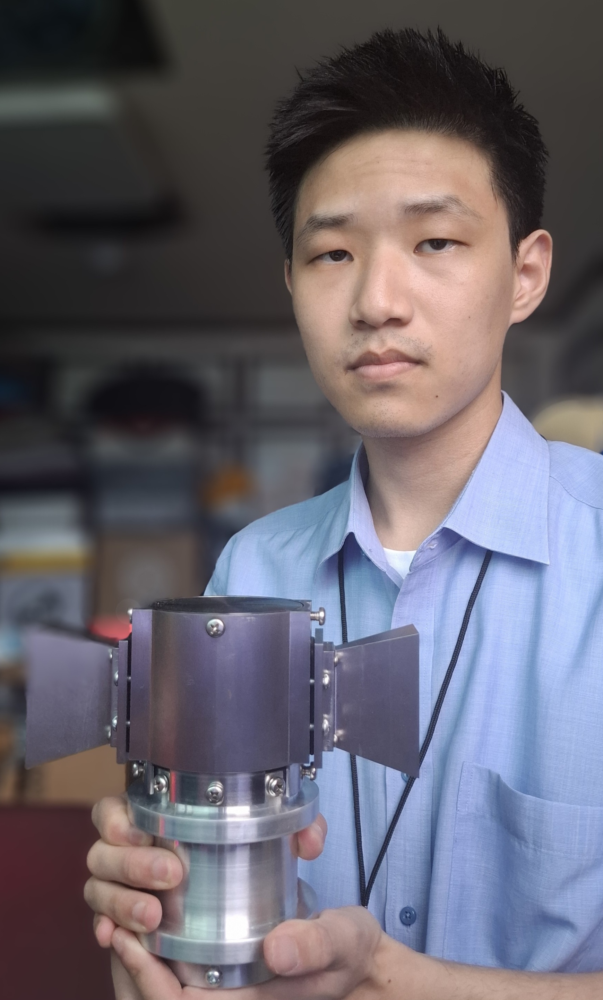

# ANVIL Aeronautics

> "I protect the FREEDOM and TRUTH, and make imagination real."

## 1. Introduction: Who Am I?
> Mobility (Freedom of Movement)
> 
> National Security (Protection of Freedom)
> 
> Aerospace Engineering (The Future of Humanity)

I am Seokjoon Lee from South Korea.
This year 2026, I am a senior in Seoul National University. I do love my major, Aerospace Engineering.
I want to be a Doer, testing the limitation of system and showing the world results.

My personal belief is following:

> In terms of faith, I believe in Jesus
> 
> In terms of Human being, I love my family, my friends, and my neighbors
> 
> In terms of Universe, I do believe the power of Science and Technology

---

## 2. A Long Journey to become an Engineering-based Entrepreneur
3학년 때부터 나만의 실무적인 것을 하고자 하는 의지가 강하였다.
그래서 기성 동아리에 들어가서 활동도 하였으나, 나는 나만의 일을 하고 싶었다.
특히 이론 중심의 학교 수업에서 탈피하여 다양한 활동을 하고 싶었다.

그래서 나는 저질렀다.
2023년 6월, 내 인생을 바꾼 일이 일어났다. 나는 내가 직접 학과 학생들을 규합하여 동아리를 만들었다.
이후 교내 대회인 창의설계축전(Creative Design Fair)을 나갔다. 아이템은 "페이로드 사출 가능 2단 분리 물로켓"이었다.
기대를 하지 않았지만 3등 상을 수상하였다.
동아리를 만들 당시 팀원들과 한 약속이 있었다.
"단돈 10만원이라도 여러분 손에 쥐어주겠다."
나는 그 약속을 지킬 수 있었다.

교통 관련 일도 하였다. 나는 기계를 다루는 것을 좋아한다. 그래서 버스 운전을 하려고 대형 면허를 취득(2023.02.)하였다.
한국 내에서 교통사고를 조사하는 자격증도 취득(2023.09.)하였다. (Traffic Accident Appraiser)

그래서 아예 2024년에는 1년을 휴학하기로 하였다.
우선 물로켓을 고도화하기 시작하였다.
기밀(sealing)이 잘 되지 않아서 단분리가 잘 되지 않았던 지난 6개월의 패인을 분석하여 마침내 단 분리를 성공시켰다.
총 3번의 발사를 하였지만, 모두 만족스러운 결과를 얻지는 못하였다.
하지만 거듭된 실패를 통해서 더 나아졌다.
1차 발사는 발사 자체가 되지 않았다. 원인은 가압된 페트병에 직접 날개를 접착제로 부착하여, 페트병이 정상적으로 팽창되지 못하였기 때문이다.
그래서 2차 발사를 수행하였으나, 단분리 자체가 되지 않았다.
마지막 3차 발사에서는 단분리는 정상적으로 수행이 되었지만, 1단 자체가 워낙 추력이 약했던 탓에, 원하는 결과를 얻지는 못하였다.

하지만 팀원들은 나를 리더로서 대단히 신뢰하였고, 나 또한 그런 팀원들을 항상 격려해주고, 밥을 사주었다.
팀원들은 각자 위치에서 정말 실무자로서 엄청난 헌신을 해주었다.
지시를 성실히 이해하고 결과물을 내놓고, 그 결과물을 가지고 나와 치열하게 토의하였다.
나 또한 팀원들이 합리적인 의견을 가지고 오면 모두 수용하였다. 나 또한 엔지니어링에 참여하였다. 특히 단분리 메커니즘은 혼자서 성공시켰다.
우리는 방학 기간동안 월요일부터 금요일까지 매일 10시부터 19시까지 작업을 했다.
추력 측정 장비 제작, 유체역학을 이용한 도달 고도 이론적 예측, 종단 속도를 이용한 낙하산 설계, 페어링 전개 메커니즘 구상, 단분리 메커니즘 구상 등
정말 다양한 것을 하였다. 특히 3D 프린터의 공차에 대한 깊은 이해를 할 수 있었다.

팀 빌딩의 아주 좋은 사례로 기억되고 있다.

이후에는 교내 창의설계축전에 다시 한번 출전(2024.09.)하였다. 아이템은 급발진 방지 및 확인 장치였다.
교통 관련 업무를 수행하면서 자동차 안전에 대한 관심이 높아진 바 그러한 아이템을 구상하였다.
1년 간 고민을 해왔기 때문에, 실 설계 및 제작은 1달 밖에 걸리지 않았다.
혼자서 출전을 해서 1등 하였다.
핵심 원리는 브레이크 패드의 마찰 저항을 이용하는 것이 아니라, 유체의 저항 및 점성을 이용하여 구동축의 속도를 연속적으로 줄이는 아이디어였다.
훨씬 더 강한 제동 토크가 발생하고, 축이 잠기는 일을 방지할 수 있을 것이라는 점에서 좋은 아이디어라고 생각하였다.

이후에는 내가 만든 장치의 성능을 측정하기 위한 토크 측정 장비를 3D 프린터로 만들어보았다.
회전하는 축에 유체를 주입하니 정말 RPM이 급격히 감소하는 것을 확인하였다.

한국 주요 대학과 중국의 하얼빈 공대 학생들이 모인 ICDF라는 대회에 서울대학교 대표로 참가(2024.11.)하였다.
나는 3등을 하였다. 1등을 한 중국 학생들은 전자기적 시스템을 이용한 인공위성 도킹 시스템을 만들었다.
나는 중국 학부생들의 기술 수준에 두려움을 느꼈다.

그때부터 나는 하나의 사명을 가지게 되었다.
기술보국.
이는 현재의 나의 가치관 중 하나인 미국의 국익에 기여하고자 함과 맞닿아 있다.

극초음속 엔진 inlet에 대한 간단한 유동 해석도 수행해보았다.

유도 발사체에 부착되어 사용될 수 있는 소형 측추력기를 제작(2024.11.~12.)하였다.
특히 셔터가 존재하는 측추력기를 고안하였다.
셔터를 개폐함으로써 유동을 조절하는 것이었다.
이때, 셔터의 중간에 홈을 뚫음으로써 유량을 확보함으로써 이론적인 추력이 증가하는 것을
Ansys Fluent 학생 버전에서 수행한 해석 결과를 통하여 확인하였다.
추력 측정 장비도 제작하였다.
다만, 개인으로서 추진 실험을 할 수 없었다.
국내 법률 때문에.

교수와 면담을 하면서 기술 사업의 존재를 알게 되었다.
때마침 서울대학교 근처에서 공용 사무실을 내어주는 것을 알게 되어 지원하였다.
그렇게 나는 2025년 1월, 호기롭게 예비창업을 도전하였다.
미국 CES도 다녀왔다. 나의 정신적 조국과도 같은 곳이다.
아예 1년 더 휴학을 하였다.

2024년 8월,
대한민국 육군에서 드론을 전문으로 하는 군인을 알게 되었는데
그는 나에게 드론에서 발사될 수 있는 소형 유도 발사체가 필요하다는 말을 해주었다.
학부생이니 전산 등록, 기체 인증 등 불가능한 영역들이 많겠지만,
프로토타입만 만들면 군부대에서 발사 시험을 할 수 있게 해주겠다고 말하였다.
그럼 그 이후의 과정은 전문 업체와 협력하면 되니까.
그래서 그것을 아이템으로 선정하였다.
특히 미국에서 방산 드론을 전문으로 하는 쉴드AI나 안두릴에 콜드 메일을 보내면 좋겠다고 생각하였다.

하지만 실패하였다.
팀원으로 영입한 10년지기 친구와의 마찰
예비창업패키지 실패
갖은 비판(그게 당장 돈이 되나요? 학부생 수준에서 만들 수 있어요? 비즈니스 모델이 뭔데요?)으로 의기소침해진 나의 모습

그래서 아이템도 새 모방 드론으로 바꾸었다.

솔직히 말하겠다.
그 당시 나는 13kg이 빠졌다. 불면증이 생겼다.
나는 나같은 사람이 신경쇠약에 빠질 거라고는 생각하지도 못했다.
단 4개월만에 나는 이러다가는 죽겠다는 생각이 들었다.

그래서 정신을 차리고 나를 반성해보았다.
기술 사업을 하겠다는 사람이 정작 기술 개발을 즐기지도 않고 성과집착에 빠졌다.
비즈니스 마인드도 부족하였다.
스스로에 대한 확신도 부족하였다.
나는 주체성, 창조자, 리더 기질로 정의될 만큼 본인의 고집이 강한 사람이다.
그런데 사업에 대한 나의 신념이 부재하였다.

국내에서 멘토링 때마다 들었던 말은
고객이 우선이다. 비즈니스 모델이 중요하다. 협력이 최우선이다.
새로운 기술보다는 Pain Point를 해결하는 게 중요하다.
시장이 가장 중요하다.
는 말들이었다.

그래서 모두의 의견을 수용하려고 하였다.
사업은 나와 비전이 맞는 VC를 대상으로 했어야 했는데,
나는 모두를 만족시켜야 한다고 생각했었나 보다.
나의 정당한 지시는 이행하지 않으면서 방향성에 대한 비판만 하던 팀원을 계속 품으려고 한 것도 그 이유였다.

5월부터 조금씩 나아졌다.
주님을 믿게 되었고, 내가 좋아하는 공학 공부를 다시 즐기게 되었기 때문이다.
닥치는 대로 사업 관련 책을 읽었다.

그러던 2025년 6월, SNAAC에서 주관하는 아이디어톤에 참가하였다.
나는 11조의 조장이었다.
이 대회는 즉석에서 비즈니스 모델을 1박 2일만에 만들어서 발표해야만 하는 대회였다.
주제는 레거시 산업에서의 혁신.
우리는 폐수 처리 산업을 혁신하기 위하여 미생물을 이용한 폐수 처리 시스템을 주제로 하였다.
팀원 중 한명이 그러한 연구를 하는 대학 연구실에서 인턴을 하였기 때문이다.
하지만 팀원 모두가 비즈니스 모델을 만들지 못하고 몇 시간 째 토의만 이어갔다.
나는 생물학이라면 딱 질색인 사람이었다.
하지만 딱 30분 동안 집중하여 핵심적인 가치를 서치하고, 하나의 통합적 논리를 찾았다.
비즈니스 모델을 만들었고, 다음날 우리는 나의 전설적인 IR을 통해 1등을 거머쥐었다.
13kg 체중 감소와 맞바꾼 순간이었다.
결국 재기에 성공하였다.

그러나 하나의 산이 더 남아 있었다.
예비 창업 당시 아이템이었던 새 모방 드론의 개발
비행 자체가 성공할지 말지도 모르는 상황에서 비행 자체가 성공하는 것을 보고 싶었다.
일종의 PoC였다.
나의 계좌에 있던 500만원을 전부 털어서 11호기까지 만들었다.
비행 실험은 15회 이상 수행하였다.
무려 8개월에 걸쳐서 말이다.
하지만 모두 실패하였다.

하지만, 개발을 하면 할수록 점점 더 나아졌다.
예를 들어서 1호기는 아예 flapping 자체가 안 됐다.
그래서 모터의 토크를 손 보고 나니까 이후에는 모두 flapping은 됐다.
경량화를 하려다가 프레임이 모두 박살난 적도 있었고, 날개 제작 방식을 바꿨더니 갑자기 배면 비행으로
뒤집히면서 -G를 받은 적도 있다.
이론적인 계산이 아니라 순전히 휴리스틱하게 접근하였다.
도저히 답이 보이지 않았다.
그래서 11월까지 하고 잠시 홀드하였다.

2025년은 정말 힘든 한 해였다.
아이디어톤을 제외하고 매달 출전하는 지원 사업, 교내 연구 프로그램, 대회마다 다 떨어졌으니까.
돈도 없었다. 그래서 울며겨자먹기로 인턴을 했다.
내 인생 첫 사회 경험이었고, 누군가의 밑에서 일을 정식으로 해본 경험이었다.
Airbility 라는 곳에서 일을 하였다.
대드론 시스템(그물총)을 만들었다.
나는 MATLAB을 통한 계산을 수행하였다.
회사에서 조직 운영에 대한 고민을 해보았다.
이 회사도 드론 스타트업이었으니까.

2025년 후반기에 재밌는 일이 두번 있었다.
한번은 9월이었다.
한국에서 KBS 인재전쟁이라는 다큐가 있었다.
공대에 미친 중국, 의대에 미친 한국
나는 의대를 갈 수 있음에도 공대를 온 사람이었다.
거기다가 이미 중국 학부생들의 수준을 두 눈으로 본 사람이었다.
심지어 나중에 알았지만, 하얼빈 공대는 미국의 제재 대상이었다.

자유주의자이고, 미국의 국익을 위하고자 하는 내가
직접 그들의 실력을 두 눈으로 본 것이다.
나는 한국에서 학부생이 아무리 꿈이 많다고 하더라도
하드웨어 기계 설계 창업을 하는 것은 어렵다고 생각하였다.
이러한 문제 의식을 가지고 있던 차, KBS 다큐에 서울대 공대 학장이 나왔다.

그래서 나는 학장실로 찾아가 그와 직접 면담을 하였다.
나와 같은 비전을 가진 훌륭한 학생들을 지원해달라.
그리고 이는 실제로 서울대학교 창업가형 혁신인재 지원 사업으로 발전하였다.
나는 그 프로그램에 뽑혀서 2026년 현재 활동을 하고 있다.

위의 기사에서도 보이듯이, 나는 한국 언론과 인터뷰도 하였다.
특히 안두릴의 팔머 럭키를 롤모델로 삼고 있다고 말했다.
사실 일론 머스크와 팔머 럭키라고 말했는데 기자가 국방 관련 내용으로 첨삭하느라 그렇게 적었단다.

또 다른 하나는 10월이었다.
ADEX2025에 참가하였다.
LIG넥스원 부스에 관람을 하던 도중
이게 웬걸
드론에서 발사되는 소형 유도 발사체 목업이 있는 거 아닌가?
심지어 쉴드AI와 계약을 체결했단다.

정확히 10개월 전 나의 아이디어, 비즈니스 모델과 거의 같았다.
물론 그들은 중견기업이고, 나는 일개 학부생이다.
하지만, 내가 주변의 비판을 무시하고 프로토타입을 빨리 만들었더라면.
기체 인증, 신뢰성 높이는 엔지니어링은 불가능해도, PoC는 가능했을 것이다.
선례가 한국에서는 없었으니까.
이 사건을 계기로 나는 스스로에 대한 확신을 가졌다.
신념을 공고히 하는 계기가 되었고, 가장 중요한 것은 실행이라고 생각하게 되었다.

이제 2026년이 되었다.
잠시 점어두었던 오니솝터를 다시 꺼냈다.
이번에는 아예 DeLaurier의 모델을 이용하여 오니솝터의 양력, 추력, 부하 토크를 모두 이론적으로 계산했다.
그에 맞추어 다시 설계를 하였다.
물론 제작 상의 문제(샤프트 유격, 무게 오차, 날개를 수동으로 제작하는 등)가 있어서 원하는 수준으로 비행을 하지는 못하였다. 하지만 10m도 못 갔던 지난 15회차를 생각하면 PoC 직전까지 갔다.
나는 절대 포기하지 않는다.
오니솝터가 비행만 성공한다면, 여기에 인공 부리를 달아서 적성 드론의 로터 블레이드를 타격하여 격추하는 것을 실증할 것이다.

나의 신념은 인류의 자유와 진실을 수호하고, 미국의 국익을 위해 일하는 것이다.
자유주의, 기독교 신앙, 가족주의, 기술보국 등의 가치가 나를 정의하기 때문이다.
나의 관심사는 모두 그렇게 귀결된다.

항공우주: 인류의 지평을 증대(이동 및 여행의 자유)
방산: 국가안보(국민의 자유를 최전선에서 지킴)
보안 취약점 찾기: 통신의 비밀을 침해받지 않을 권리, 전체주의적 검열 및 감시에 대한 저항
BCI: 인간의 자유 의지

최근에는 4륜 구동 시스템과 EDF + Jet Vane으로 구성된 하이브리드 모빌리티, 일명 에어로로버를 설계 중이다.

이제, 미래를 향한 나의 여정은 다시 시작한다.
그 길에 함께 하기를 바란다.

## 3. My Projects
미래를 향한 나의 5대 핵심 프로젝트는 아래와 같다.
<a href="ornithopter.html" class="project-card">
    
    <strong>Ornithopter with Peak</strong>
    A Drone emulating birds' flapping motion
</a>

<a href="aerorover.html" class="project-card">
    
    <strong>AeroRover (Hybrid Mobility)</strong>
    Terrestrial and Aviational Combined Mobility System
</a>

<a href="hydrogen.html" class="project-card">
    
    <strong>Hydrogen Hybrid Drone</strong>
</a>

<a href="bci.html" class="project-card">
    
    <strong>Cognitive Attack with Microwaves</strong>
</a>

<a href="nasa.html" class="project-card">
    
    <strong>NASA Vulnerability</strong>
</a>

### (1) Project "Ornithopter"
생체 모방 비행 기술 및 대드론 방어 체계 연구. MATLAB 및 Ansys Fluent를 활용한 정밀 유체역학 해석을 완료했습니다.

### (2) Project "AeroRover"
지상 주행과 공중 비행이 모두 가능한 차세대 하이브리드 모빌리티 시스템 (Hybrid Mobility System).

### (3) Hydrogen Hybrid Drone System
수소 하이브리드 드론 개발을 위한 수소 스택 이용에 대한 제어공학적 방법을 만들었습니다.

### (4) Harvana Syndrome
전파 공격 무기에 대한 연구를 수행하였습니다. (Coming Soon)

### (5) NASA Security Vulnerability
나사 보안 취약점을 찾았습니다. (Coming Soon)
